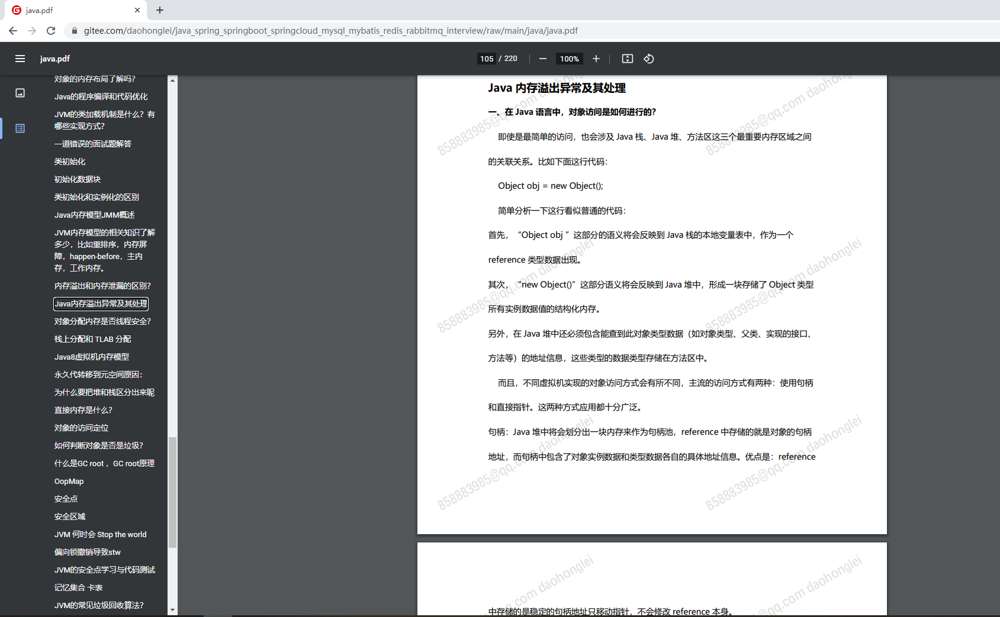

### java 初 中 高 各级知识点集合
#### 以上内容全部是本人学习工作过程中记录的java知识点，包含java mysql redis spring springboot spring-cloud等内容
#### 其中demo 和 ldh-utils文件夹是两个项目，其他都是这个知识点pdf

### java 内容
java基础 集合框架 反射 多线程 锁 类加载 jmm jvm结构 垃圾回收算法 jvm优化

### spring内容
spring初始化过程 springboot启动流程 spring扩展点 循环依赖解决方案 springmvc 生命周期 spring事务原理 事务 gateway网关配置

### mysql内容
事务隔离界别 存储引擎 连接方式 锁 MVCC redo-log undo-log 缓存池 脏页刷盘时机  explain执行计划解读

### redis内容
数据结构 缓存雪崩 缓存穿透 持久化机制 事务 lua脚本

### ldh-utils
主要是用自动装配写的一些工具类，redis 锁 限流 登录失败锁定用户 

### demo
对ldh-utils工具类的一些使用验证，还有别的一些验证代码，例如秒杀

可以不用下载到本地，可以直接线查看学习，持续更新，欢迎各位收藏
